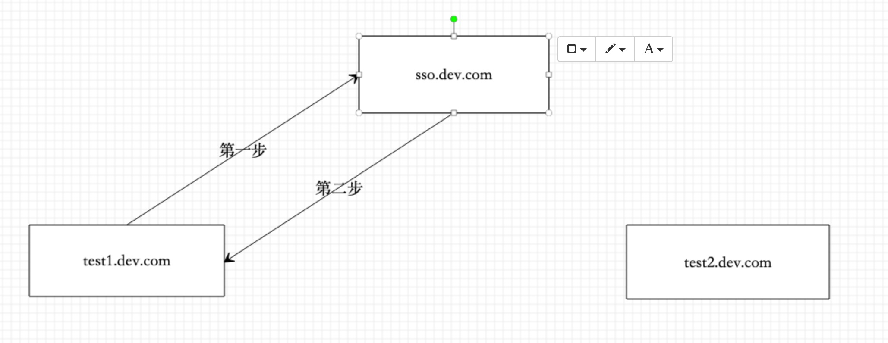
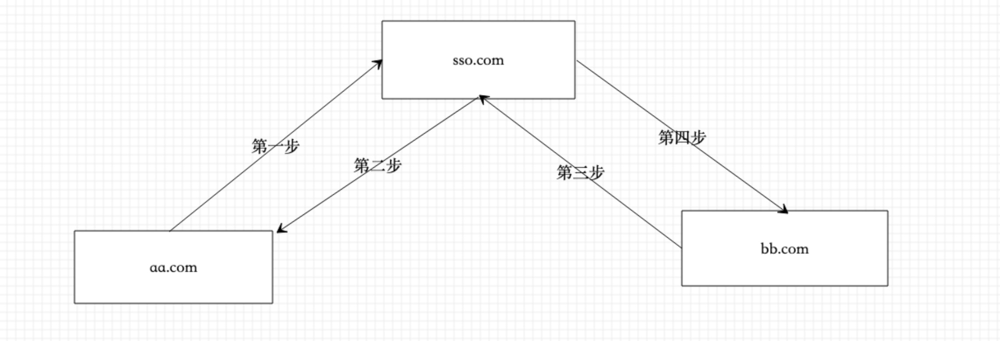

# SSO（单点登录）的实现方案有多种
## 一、相同的顶级域名（比如xx.aa.com, xxx.aa.com）


```text
利用cookies 在顶级域名下可以相互通信（设置cookies 时 domain设置为.aa.com）
第一步：浏览器输入test1.dev.com，如果本地没有cookies(可以判断已经等了的cookies)，就跳转到sso.dev.com，然后输入用户名，密码，将登陆接口返回的token 存入cookies(domain设置为.dev.com)
第二步：跳转回test1.dev.com，这个时候就可以在本地拿到cookies了，
第三步： 用户输入test2.dev.com也可以拿到cookies
如果接口是通过携带cookies来判断用户晓得这种方式很容易遭受csrf攻击，解决办法可以用auth_token(放到header), 校验referer 等校验
```


## 二、完全不同的域名（比如xx.aa.com, xxx.bb.com）


```text
第一步：浏览器输入aa.com，如果本地没有localStorage 或者cooKies 可以判断是否登录，就跳转到sso.com，然后输入账号密码登陆，将返回的token 存入coookie或者localStorage，同时后端的sso服务也写入该用户已经登陆；
第二步：url带着token重定向到aa.com，aa.com拿着token 校验token 是否有效（后端可以提供一个接口来校验），如果无效则在重定向到sso.com，通过参数清除本地的缓存， 如果有效则缓存在本地cookies或者localStorage，然后去掉url上的token，重定向到aa.com，后aa.com每发一个请求都带上token（后端会去校验token的有效性）；
第三步：浏览器输入bb.com 时先判断本地是否有localStorage 或者cooKies 种有token，如果有则正常的携带token 去发送请求，如果没有就跳转到sso.com,如果这个时候本地的coookie或者localStorage有token,就携带token 跳转回bb.com（重复第二个步骤中的动作）

如果整个过程都是用localStorage作为存储安全性会高一些，如果使用cookies作为存储据需要注意csrf,接口携带的token 尽量都放到header头上
```
